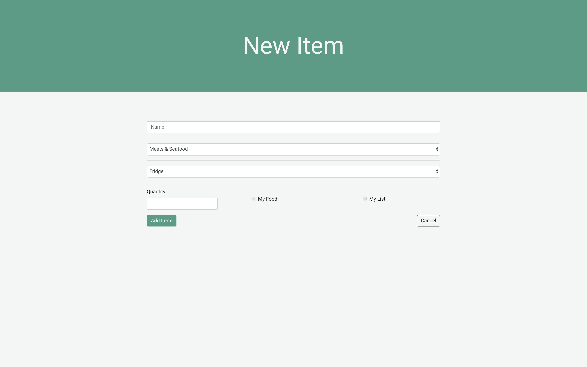
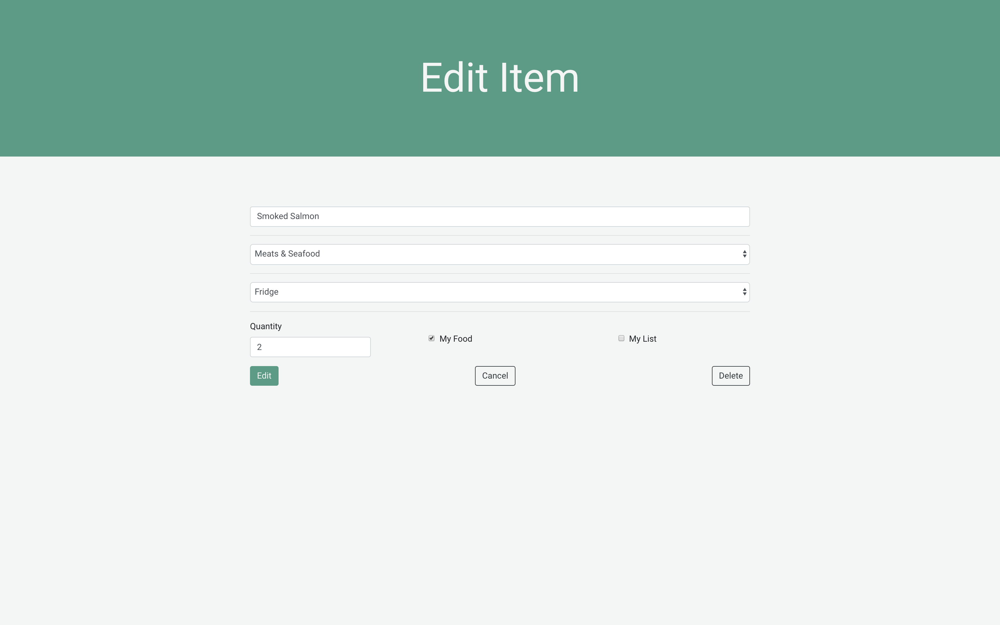
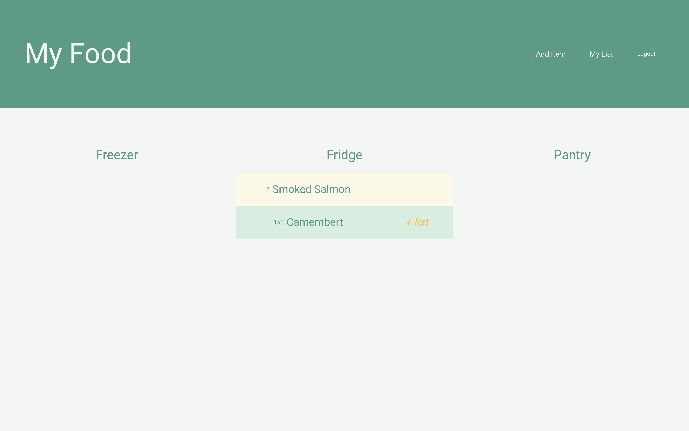
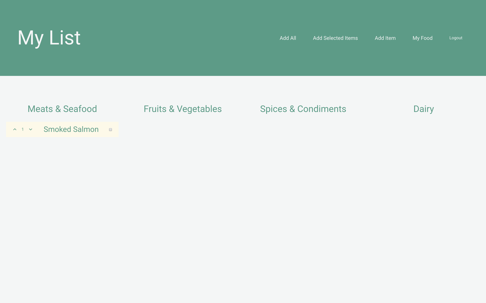
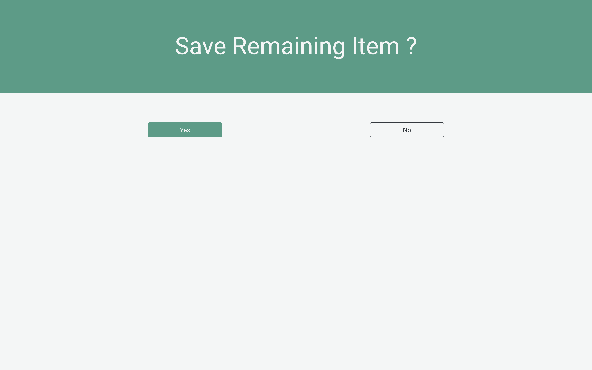

# Groceries Helper App

Groceries Helper assist the user to track what are his/her current food stocks. The app also provides with a groceries list interface that the user can update using different functionalities.

When creating an new food item, the user select the category to store the item and must select the checkbox accordingly.

An item can also be edited by clicking on the item itself.

 

## My Food Page
The food page list food items in 3 categories: freezer, fridge and pantry. 

If an item is not on the list, the user can click the "add to list" link to do so instantly.

 

## My List Page
The food page list food items in 3 categories: freezer, fridge and pantry. 

The user can directly increment or decrement the quantity of an item on the list by clicking on the corresponding arrow.

The user can also select items with the checkbox and add them all to the list by clicking "add selected items"

If there's remaining items, the user will have the possibility to save them on the list or remove them.

 

## Technologies Used

HTML5 | CSS3 | Javascript | React.js | Node.js | Express | MongoDB | Mongoose | Jwt | Bootstrap 

 

## Getting Started

 

## Next Steps 

- Create cuztomizable categories for the food page and the list page  
- Update the starting budget automatically when a detail with an expense has been added and completed
- Upload photos of previous trips
- Add a map feature to both previous and upcoming trips to draw itineraries